# 6.1 Web API & Client - Products By Category + Form

Enda Lee 2022

### Quick Start

1. Make sure the **[latest Server API](https://github.com/elee-tudublin/2022.SSWD_6.2_Web-API_Database)** app is running on http://localhost:5000
2. Download the start site from this repository.
3. Open in VS Code (separate to the server API instance).
4. In a terminal run `npm install`.
5. Start the application using `npm run start` so that it runs on http://localhost:3000


## Introduction

This tutorial adds co to the web application from Part 1, adding the following features:

1. Show the categories in the left menu (replacing first item, etc.).
2. Add code so that when a category is clicked the product list is updated to show only products from that category.
3. Add a menu item to the category list to display all products when clicked.
4. Add the code etc. to display the details for a single product when a product name is clicked. Display the product details in a new section under the products table.

Some of the client-side functionality requires changes on the server-side API which will also be covered here.


## Pre-requisites

As always, the application is based on **separate** **`client`** and **`server`** applications which should be opened in separate VS Code instances when working on this lab.

##### Server-side

The client functionality is dependent on a server API with Category and Product endpoints.

Start with the completed server API to date:

https://github.com/elee-tudublin/2022.SSWD_6.2_Web-API_Database

##### Client-side:

Start with the code from this repository which should be downloaded and opened in VS Code.


## Getting Started

This start site includes `Bootstrap`, etc. Content from the `public folder` is `served` by NodeJS and can be accessed via

http://localhost:3000

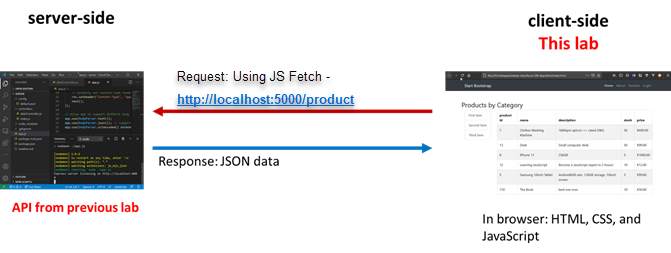

The client site/ application will fetch its data from the server-side API running on http://localhost:5000


## 1. Show the categories in the left menu

The goal is to display a list of categories on the left side of the page, like this example.

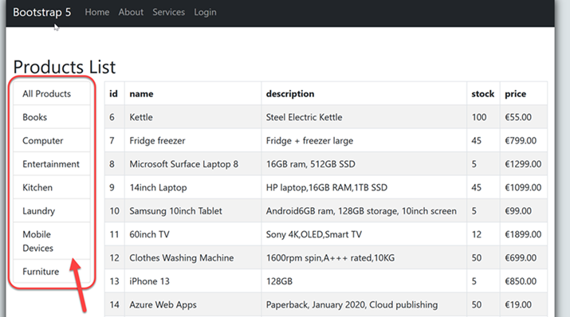


### Retrieving all `categories` from the API

Before they can be displayed, the `categories` must first be requested from the API. The process is similar to getting products from the API, except that we must call the API endpoint which returns categories. Test it in a web browser by opening http://localhost:5000/category

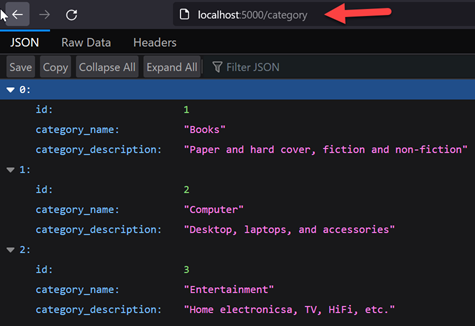 

This shows that the endpoint is available and returning data, now use a  `JavaScript Fetch` call to do the same in the client app.

##### Open `index.js` and find the `loadAndDisplayData()` function.

1. Get the `categories` by passing the required `API Endpoint` to the `getDataAsync()` function.
2. If `categories` returned then call the `displayCategories(categories)` function to display them. That function will be added in the next step.

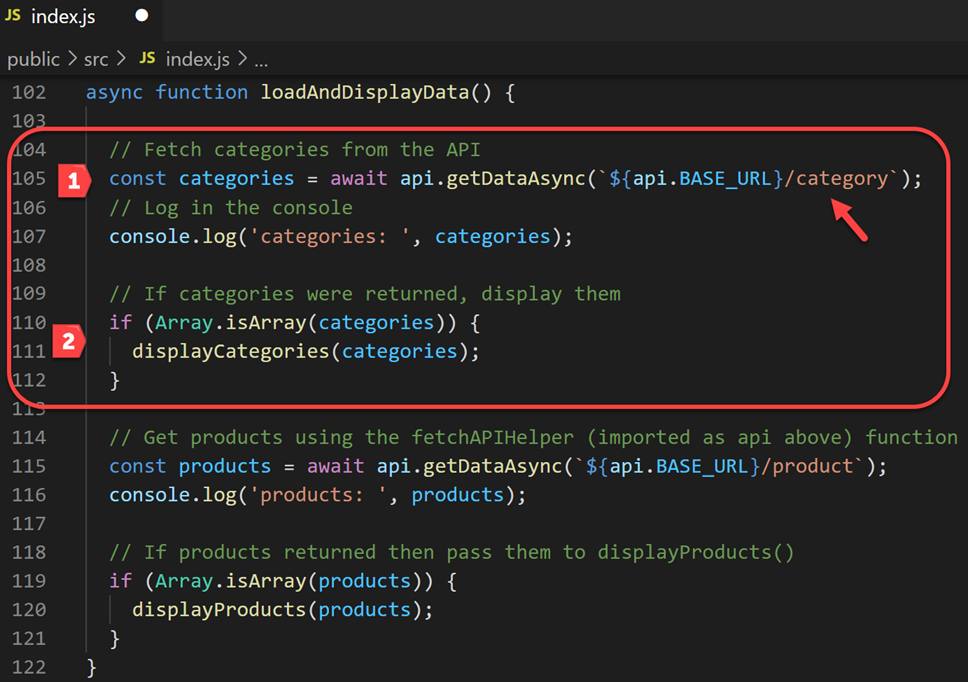


#### Displaying `Categories`

The **`displayCategories()`** function in **`index.js`** is responsible for adding a list of **`categories`** to the page. It works much the same as the function used to display products.

1. Use `map` to iterate through the array of categories and generating the required `HTML button` elements for each `category`. Each button includes the `category.id` and `category.name`.
2. Add a link button for `all products` at the start of the `catLinks ` array. This link will set `data-category_id="0"` and display products from all `categories` when selected.
3. Add the contents of the `catLinks` array, which contains the button links, into the page element with `id="categoryList"`.
4. Add `event listeners` for the category button links so that the `filterProducts()` function is called when clicked.

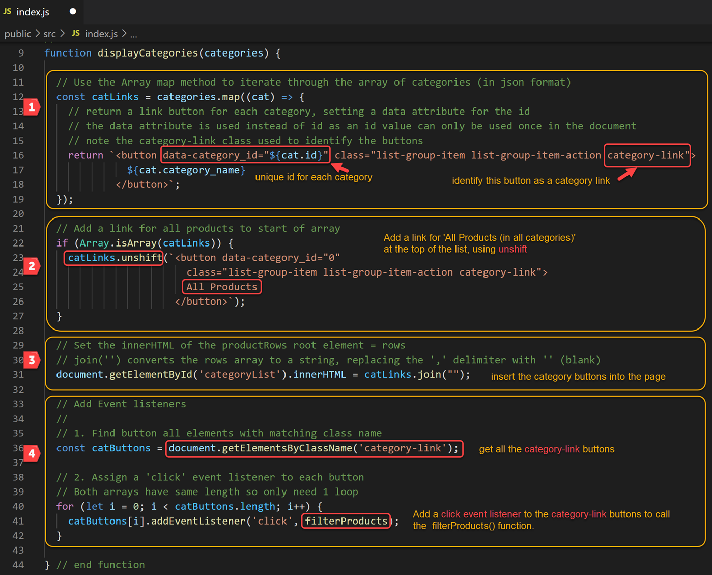


### Get products for a category and display

When a category link is clicked, get products in that category and display them on the page. 

#### 1. Server-side

The `product/bycat/:catId` end-point gets products by category id. It is defined in the **`product controller`**

```javascript
// Endpoint to handle requests for product by id
// req.query version
// req format: /product/bycat/4
//
router.get("/bycat/:catId", async (req, res) => {
    // read values from req
    const catId = req.params.catId;
  
    // If params are missing return 400
    if (typeof catId === "undefined") {
      res.statusMessage = "Bad Request - missing cat id";
      res.status(400).json({ content: "error" });
    }
    // Get products 
    try {
      const result = await productService.getProductsByCatId(catId);
  
      // Send response back to client
      res.json(result);
  
      // Catch and send errors
    } catch (err) {
      res.status(500);
      res.send(err.message);
    }
  });
```

The endpoint above call a function in  **`productService.js`** to **`getProductsByCatId(catId)`**. 

This function validates the `catId` and then makes a call to get the data.

```javascript
// Function to get products in a specified category (by category id)
//
async function getProductsByCatId(id) {

    // validate the id
    const validatedId = validate.validateId(id);
  if (validatedId) {

    // Call the data access function to get product matching id
    const products = await productData.getProductsByCatId(validatedId);

    // return the products found
    return products;
    
  } else {
      return "Invalid product id";
  }
}
```

 Finally a data access function, **`getProductsByCatId(catId)`** which should be added to **`productData.js`** in the API

This function queries the database, finding **all** `products` **where** `category_id = catId`. The products found are returned.

```javascript
// Get products from DB by cat id
//
async function getProductsByCatId(catId) {

    // define variable to store products returned
    let products;

    // execute the query to find products
    try {
        // find all products
        products = await prisma.product.findMany ({
            // where category_id = catId
            where: {category_id: catId}
        });

    // Catch and log errors to server side console 
    } catch (err) {
        console.log('DB Error - get products by category: ', err.message);
    } finally {

    }
    // return all products found
    return products;
}
```


#### 2. Client side - filter products by category

Back to the `client side`. When one of the category links is clicked, products from that category should be loaded and displayed. 

Each of the `category links` has a  `data-category_id` property to identify which category should be displayed. 

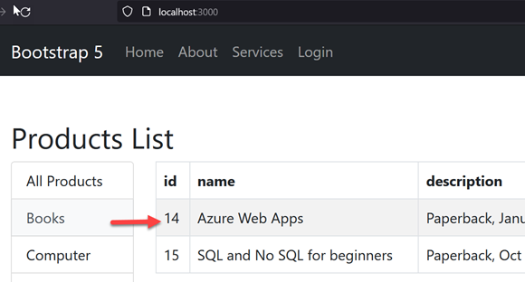


When a category is clicked, the **`filterProducts()`** function, in **`index.js`**, is called. This function does the following

1. Get the `category id` of the clicked button (`this`).
2. If the `catId` is not valid then `loadAndDisplayData()`.
3. Otherwise call the API endpoint `/product/bycat/` with the id of the category required.
4. Call `displayProducts()` passing the `products` array.

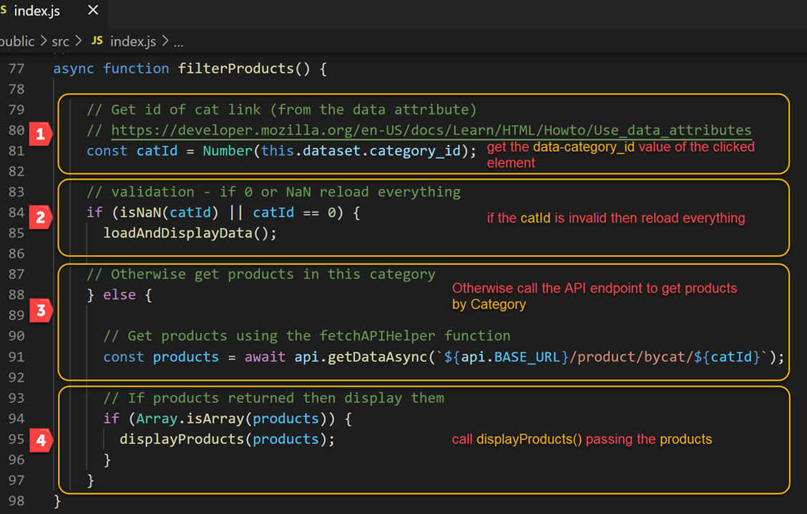


### Display the details for a single product


#### 1. The server-side API

The`API` includes an endpoint which returns a product by its`id`. Test it in a web browser by opening http://localhost:5000/product/6

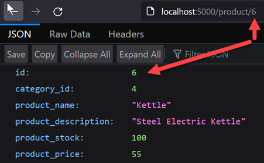

For details see the following server-side API scripts:

1. The `/:id` endpoint in`productController.js`.
2. The `getProductById(id)` function in `productService.js`.
3. The `getProductById(id)` function in `productData.js`.


#### 2. Client-side: add an HTML form to display a single product

Add client side functionality to select a product and view its details in a form. Later this functionality will also be used to edit products.

The screen-shot shows a button next to each product. When clicked, a function is called which gets the product by id and fills out the form. This is a modal form, when displayed it appears as a dialog in focus and in the foreground.  The site page is greyed out in the background.

For more about modal dialogs see https://getbootstrap.com/docs/5.0/components/modal/

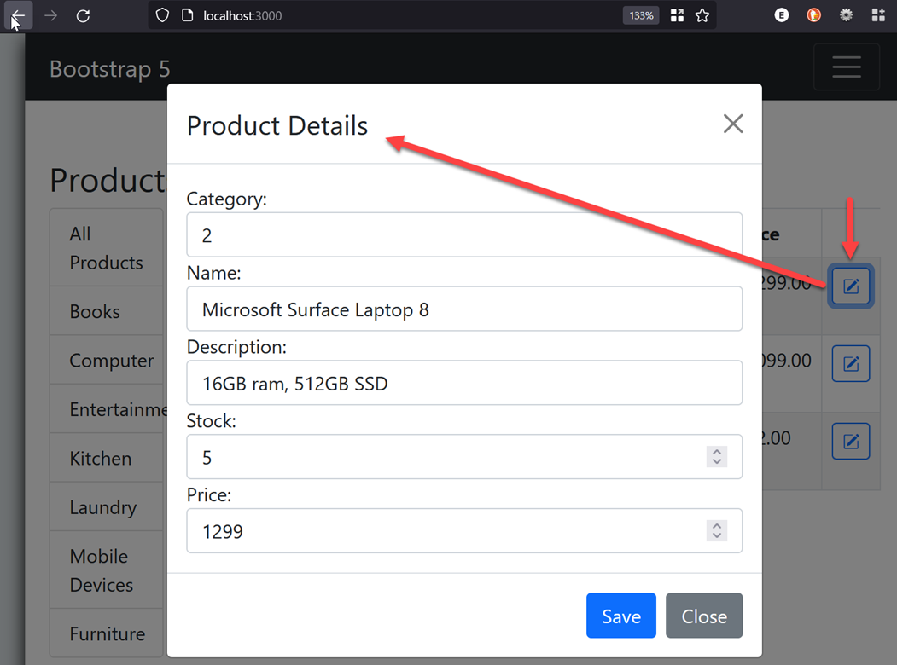


##### The Modal dialog and form in `index.html`

The Bootstrap 5 modal dialog defines a `header`, `body`, and `footer` sections. The `product form` is defined in the `body` section. Other than being defined in the modal, it is a standard form (with Bootstrap styling). Note the form `input` elements for each of the `product attributes` . The form button are defined in the modal footer.

The `id` attribute value of the modal `div element`, `productFormDialog` will be used elsewhere to show or hide the modal.

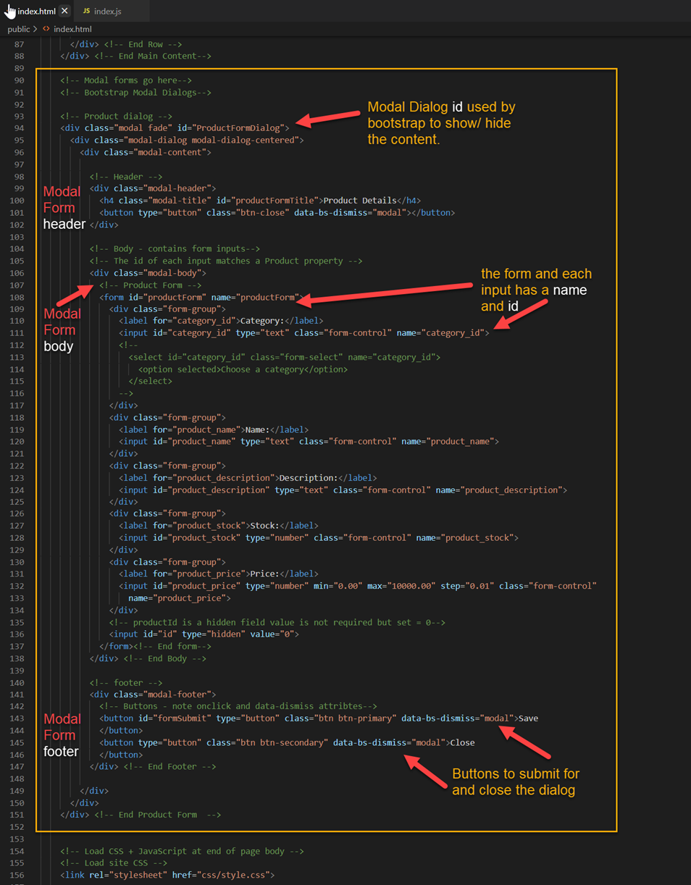


##### Filling the form with product details

The browser screenshot above shows a button next to each product in the table

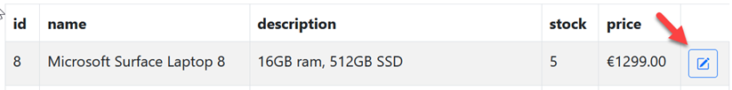

Clicking the button does the following:

1. Use the `id` to fetch a `product` from the `API`.
2. Show `productFormDialog`.
3. fill the input elements with the product attribute values.


The **`displayProducts()`** function in **`index.js`** has been updated to add the button and is behaviour.

*Numbered below:*

1. set `data-product_id` for each button.
2. add the `btn-update-product` class to each button so that they can be referenced by `document.getElementsByClassname`.
3. Add the Bootstrap `data-bs-toggle` and `data-bs-target` so that this button can be used to show or hide a the `ProductFormDialog` model element.
4. Get a list of the buttons.
5. Add a `click` `event listener` to the buttons, calling `prepareProductUpdate()`.

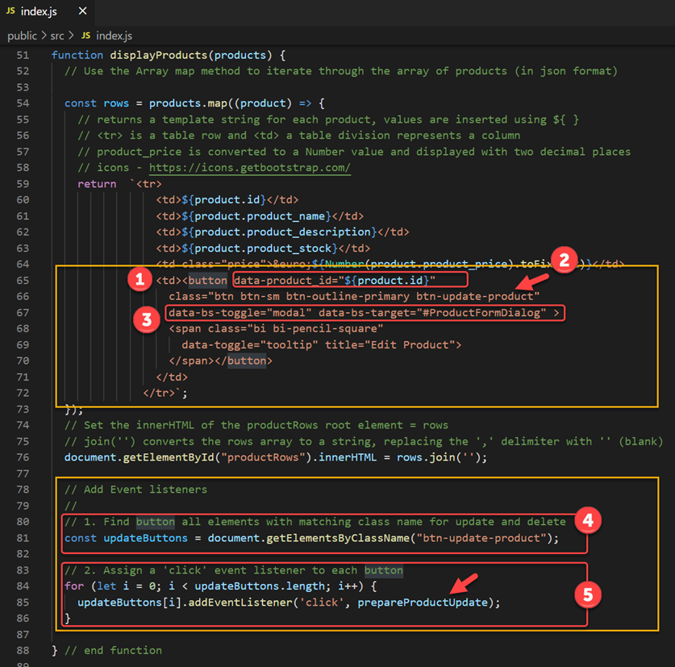


## Test the Application

With he the server API running, open http://localhost:3000. You should see the buttons in each product row. In your browser right-click the page to **Inspect element**. This will reveal the HTML generated for the button.

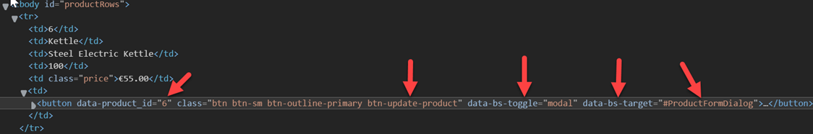 

Try the buttons and verify that the correct product details are displayed in the form.


------

Enda Lee 2022